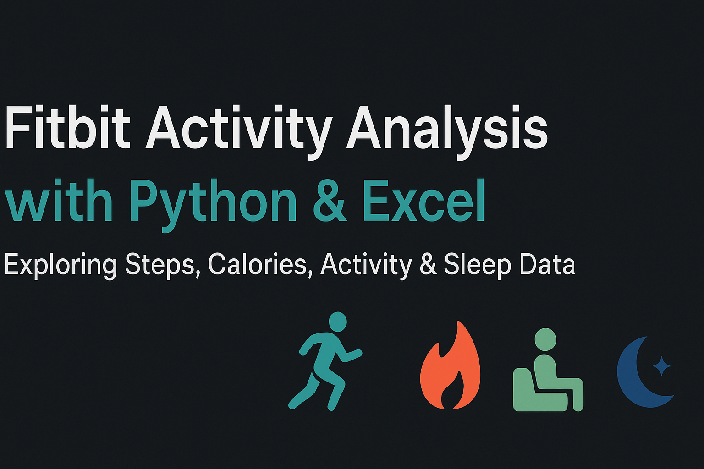

<p align="center">
  
</p>


# Fitbit Activity Analysis

A Python and excel project to analyze Fitbit activity data. Explores daily routines, physical activity, sedentary behavior, calorie burn, and rest patterns using Pandas, Seaborn, and Matplotlib.

---

## 📋 Dataset

The data includes daily Fitbit metrics with the following columns:

| Column | Description |
|---|---|
| `ActivityDate` | The date of the record (daily) |
| `TotalSteps` | Total number of steps taken that day |
| `TotalDistance` | Total distance traveled (km or miles) |
| `TrackerDistance` | Distance tracked via Fitbit tracker sensor |
| `LoggedActivitiesDistance` | Distance from logged activities (if applicable) |
| `VeryActiveDistance`, `ModeratelyActiveDistance`, `LightActiveDistance` | Distance traveled during activity levels |
| `SedentaryActiveDistance` | Distance “active” while sedentary (if available) |
| `VeryActiveMinutes`, `FairlyActiveMinutes`, `LightlyActiveMinutes` | Minutes spent in different activity intensities |
| `SedentaryMinutes` | Minutes spent sedentary |
| `Calories` | Calories burned |

---

## 🔍 Questions / Analyses

I solved the following questions:

1. Calories burnt by total steps  
2. Sedentary minutes vs calories burned  
3. Sedentary minutes vs total active minutes  
4. Calories burnt by day of the week  
5. Total steps taken by day of the week  
6. Total time asleep by day of the week (using sedentary minutes as a proxy for rest)  
7. The most and least active hours of the day (converted from minutes since hourly timestamps not available)

---

## 🛠 Technologies / Tools

- Python  
- Pandas (for data manipulation)  
- Seaborn & Matplotlib (for plotting)  
- Jupyter Notebook (if used for exploratory analysis)

---

## 📈 Key Insights

- More steps generally lead to higher calorie burn.  
- Sedentary periods dominate most days, showing potential for more movement.  
- Light activity is the most common intensity level throughout the day, with bursts of “very active” minutes.  
- Sleep/rest times and activity patterns vary significantly by day of the week—weekends tend to have more rest or downtime.  

---

## 📊 Excel Dashboard

In addition to the Python analysis, I also built an **dashboard in Excel** to summarize key insights visually.  

### Dashboard Preview:


### Dashboard Highlights:
- **Percentage of Activity in Minutes**: Majority of time spent sedentary (81%), with smaller proportions of light, moderate, and very active minutes.  
- **Calories vs Steps Taken**: Positive correlation between steps taken and calories burned.  
- **Calories Burnt per Hour Logged**: Shows fluctuations in energy expenditure per logged hour.  
- **User Login Trends**: Highest engagement mid-week (Tue–Thu), slightly lower on weekends.  

This dashboard complements the Python plots by providing a **quick, business-style overview** of the dataset.

---
## 🚀 How to Reproduce

1. Clone this repository  
2. Install required libraries (example with `requirements.txt`):

   ```bash
   pip install pandas seaborn matplotlib
   ```

3. Load your Fitbit data into a Pandas DataFrame (CSV or other format) with the columns listed above.  
4. Run the notebooks/scripts doing each of the analyses listed. Save plots as PNGs.  
5. Optionally, upload this README, plots, and notebooks to GitHub or share via blog post.

---

## 📂 Project Structure 

```
fitbit-activity-analysis/
├── data/
│   └── fitbit_daily_data.csv
├── notebooks/
│   └── analysis.ipynb
├── plots/
│   ├── steps_vs_calories.png
│   ├── sedentary_vs_active.png
│   └── ... other plots
├── README.md

```

---

## 🔗 Link to Full Blog

Read the full write‐up, plots, and detailed insights on my blog:  
[Analyzing Daily Activity Using Python & Fitbit Data](https://fitbit-activity-analysis.blogspot.com/2025/09/analyzing-daily-activity-using-python.html)

---

## ## 📊 Presentation

[View on Canva](https://www.canva.com/design/DAGzRUoK3Co/2ItcovRx7NhYYTa-qELv4A/edit?utm_content=DAGzRUoK3Co&utm_campaign=designshare&utm_medium=link2&utm_source=sharebutton)

---

👨‍💻 **Author:** Munawer Jabeen  
📬 Reach me on [LinkedIn](https://www.linkedin.com/in/munawer-jabeen-900811380/) | [GitHub](https://github.com/Mjabeen164)  
